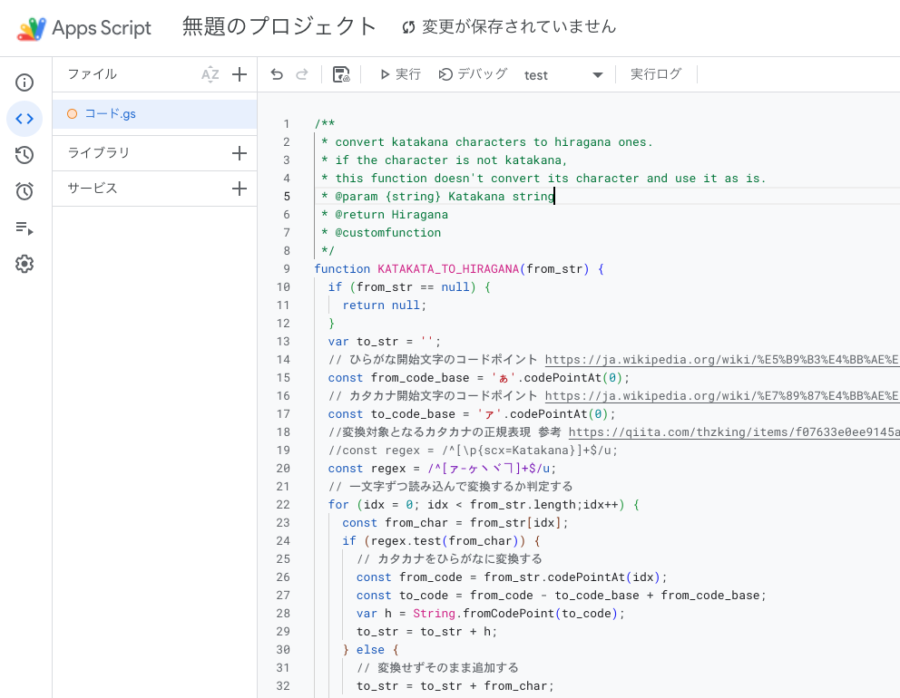
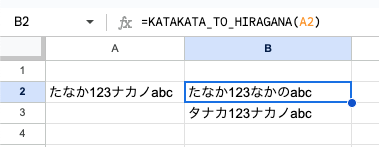
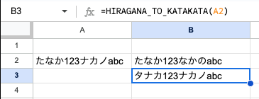

# katakana_hiragana

これは文字列中のカタカナをひらがなへ、ひらがなをカタカナへ変換する Google Apps Script のスクリプト(カスタム関数)です。
Googleスプレッドシートでの利用を想定しています。スプレッドシートからこれらの関数を呼び出します。

## 使い方

- 1 Googleスプレッドシートを作成します
- 2 メニューの `拡張機能` から `Apps Script` を開きます
- 3 スクリプトの内容をファイルに貼り付けます
    - デフォルトで `コード.gs` というファイルが用意されているので、そこに貼り付けます
    - 
- 4 スプレッドシートから `KATAKANA_TO_HIRAGATA`、`HIRAGANA_TO_KATAKANA`を呼び出します
    - 
    - 


## 参考

- カタカナ開始文字のコードポイント https://ja.wikipedia.org/wiki/%E7%89%87%E4%BB%AE%E5%90%8D_(Unicode%E3%81%AE%E3%83%96%E3%83%AD%E3%83%83%E3%82%AF)
- ひらがな開始文字のコードポイント https://ja.wikipedia.org/wiki/%E5%B9%B3%E4%BB%AE%E5%90%8D_(Unicode%E3%81%AE%E3%83%96%E3%83%AD%E3%83%83%E3%82%AF)
- JavaScriptで平仮名(ひらがな)を判定する https://qiita.com/thzking/items/f07633e0ee9145a85ace

## ライセンス

```
MIT License

Copyright (c) 2025 Hiroki Taira

Permission is hereby granted, free of charge, to any person obtaining a copy
of this software and associated documentation files (the "Software"), to deal
in the Software without restriction, including without limitation the rights
to use, copy, modify, merge, publish, distribute, sublicense, and/or sell
copies of the Software, and to permit persons to whom the Software is
furnished to do so, subject to the following conditions:

The above copyright notice and this permission notice shall be included in all
copies or substantial portions of the Software.

THE SOFTWARE IS PROVIDED "AS IS", WITHOUT WARRANTY OF ANY KIND, EXPRESS OR
IMPLIED, INCLUDING BUT NOT LIMITED TO THE WARRANTIES OF MERCHANTABILITY,
FITNESS FOR A PARTICULAR PURPOSE AND NONINFRINGEMENT. IN NO EVENT SHALL THE
AUTHORS OR COPYRIGHT HOLDERS BE LIABLE FOR ANY CLAIM, DAMAGES OR OTHER
LIABILITY, WHETHER IN AN ACTION OF CONTRACT, TORT OR OTHERWISE, ARISING FROM,
OUT OF OR IN CONNECTION WITH THE SOFTWARE OR THE USE OR OTHER DEALINGS IN THE
SOFTWARE.
```
